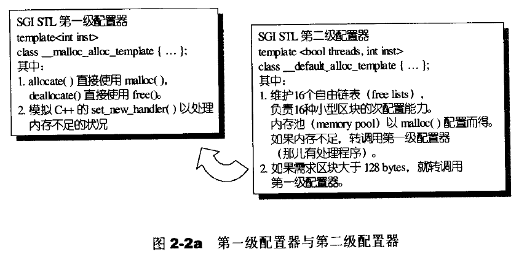

# STL-note
note of book &lt;effective STL> and &lt;the Annotated STL Sources>

###因为作者把STL浏览了一遍，感觉没有在开发中特别有用的新内容，所以本书暂停更新（逃走）


## STL源码剖析

### 第二章：allocator

allocator是一个可以将内存分配和对象构造分离开来的东西，因为new是先分配内存，然后一定会调用类的构造函数，两者绑定在一起会不是很方便，效率也比较低。所以allocator允许我们先分配一个内存，不调用对象的构造函数。使用的时候必须显式的调用对象的构造函数。举个例子：

```
std::allocator<std::string> alloc; // 可以分配string的allocator对象
int n{ 5 };
auto const p = alloc.allocate(n); // 分配n个未初始化的string

auto q = p; // q指向最后构造的元素之后的位置
alloc.construct(q++); // *q为空字符串
alloc.construct(q++, 10, 'c'); // *q为cccccccccc
alloc.construct(q++, "hi"); // *q为hi

std::cout << *p << std::endl; // 正确：使用string的输出运算符
//std::cout << *q << std::endl; // 灾难：q指向未构造的内存
std::cout << p[0] << std::endl;
```

allocator的必要接口：

```C++
allocator::value_type
allocator::pointer
allocator::const_pointer
allocator::reference
allocator::const_reference
allocator::size_type
allocator::difference_type
```

allocator 的源码如下，实际上只是operator new和operator delete的包装。没做什么事情，实际上我们使用的是名为alloc的特定版本，拥有allocator和construct、deallocator和deconstruct：

```
template<class T>
inline T allocate(ptrdiff_t size, T*){
    set_new_handler(0);
    T* tmp = (T*)(::operator new((size_t)(size * sizeof(T))));
    if(tmp == 0){
       cerr << "out of memory" << endl;
    }
    return tmp;
}
template<class T>
inline void deallocate(T* buffer){
    ::operator delete(buffer);
}
template<class T>
class allocator{
public:
    typedef T value_type;
    typedef T* pointer;
    typedef const T* const_pointer;
    typedef T& reference;
    typedef const T& const_reference;
    typedef size_t size_type
    typedef ptrdiff_t difference_type;
    pointer allocate(size_type n){
        return ::allocate((difference_type)n, (pointer)0);
    }
    void deallocate(pointer p) { ::deallocate(p); }
    pointer address(reference x) { return (pointer)&x; }
    const_pointer const_address(const_reference x){
        return (const_pointer)&x;
    }
    size_type init_page_size(){
        returnmax(size_type(1), size_type(4096/sizeof(T)));
    }
    size_type max_size() const {
        return max(size_type(1), size_type(UINT_MAX/ sizeof(T)));
    }
};
//特化版本
class allocator<void>{
public:
    typedef void* pointer;
}
```

allocator的destroy有两个版本，一个版本是直接把对象析构掉，另一个版本是把[first, last)个对象析构掉，如果这些对象都是trivial destructor（无关痛痒的析构函数），那么就不管他，如果不是的话，就一个一个析构掉。所以为了实现第二个版本，STL会增加“对象是否是trivial”的判断，使用value_type()来判断

**空间的配置和释放**

allocator会考虑内存破碎问题，所以在底层设计的时候有一个双层配置器，当配置区块超过128Bytes的时候，认为足够大，调用第一级配置器，当申请区块小于128Bytes的时候，被认为足够小，使用memory pool内存整理方式。具体如下所示



能够看出的是，allocator使用的是malloc和free来配置内存，而不是用new和delete来配置内存，这一点归结于历史原因。

第一级配置器在内存不够的时候尝试调用oom_realloc和oom_malloc，如果oom_realloc和oom_malloc再出现错误的话，会直接抛出异常，这时候就需要客户端来处理内存不足错误了。

第二级配置器在内存不够的时候会尝试调用第一级配置器，除了128Bytes的限制以外，第二级配置器还会自动对齐小区块需要的内存数量，例如申请30Bytes的小额区块，则实际上会申请32Bytes，并且维护16个free-lists（用来管理闲置内存）分别管理8,16,24,32,40...112,120,128bytes的小额区块。allocate和deallocate的free list区块示意图如下所示


当free lists中没有可用区块的时候，程序将会调用refill为freelist重新填充空间，新的空间是从内存池（chunk_alloc()完成)取出来的，源代码如下所示：


对于chunk_size来说，他每次从内存池申请空间都会申请20个块，比如下面这个例子，所以其实每次申请少一点会让空间利用率比较好


##### 几个内存处理工具

uninitialized_copy:把[result, result+(last-first))范围内的内一个迭代器都初始化，只是调用每一个元素的construct，这样就把构造和内存的配置分离开来,与之对应的有uninitialized_copy_n

```
template <class InputIterator, class ForwardIterator>
ForwardIterator uninitialized_copy(InputIterator first, InputIterator last, ForwardIterator result);
```

uninitialized_fill: 对范围内的每个迭代器都用最后一个元素的值来构造,与之对应的有uninitialized_fill_n

```
template <class forwardIterator, class T>
void uninitialized_fill(forwardIterator first, forwardIterator last, const T& x);
```

uninitialized_fill的实现方式：

1. 先使用value_type(first)得到迭代器的值类型，判断是否是POD（Plain Old Data, 指的是传统的C类型，他们这些数据已经拥有了trivial copy/ assignment 等函数）
2. 如果是标量类型，那么直接调用高效的copy方法
3. 如果不是标量类型，那么就用for循环调用构造函数，具体流程如下图所示：


### 第三章：迭代器（iterator）和traits

迭代器的精髓在于他把数据容器（containers）和算法分开，最后再粘在一起，C++和class templates和function templates 可以分别实现这两个功能。所以如何设计出这两个之间的粘合剂是非常重要的。

迭代器本质是一个smart pointer， 所以对于他来讲，重载operator*和operator->是非常重要的


